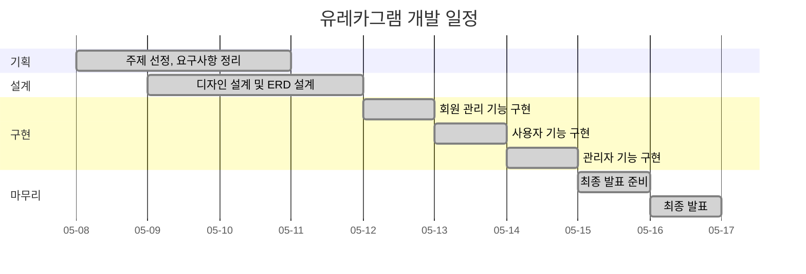

## ✨ 유레카그램
> LG U+ 유레카 부트캠프 미니 프로젝트              
> 프로젝트 기간 : 25.05.08 ~ 25.05.16    
> 유레카그램은 유레카 부트캠프 참여자들만을 위한 비공개 커뮤니티 피드형 SNS 입니다.


## 1. 목표와 기능

### 1.1 목표
- 유레카 부트캠프 훈련생만 참여할 수 있는 **사적이고 안전한 커뮤니티 공간**
- 일상, 생각, 경험 등 훈련생만의 이야기를 자유롭게 나눌 수 있는 **피드형 SNS**
- 동료 간 친밀감과 신뢰를 쌓아 **자연스러운 관계 형성**
- 훈련 기간뿐만 아니라 수료 이후에도 이어지는 **사적인 네트워크 유지**
- 외부 시선 없이 편하게 소통할 수 있는 **비공개 전용 공간** 제공

### 1.2 기능
- 회원 인증을 거친 **비공개 커뮤니티 운영**
- 사진, 글 등 다양한 형식의 **개인 피드 업로드 및 공유**
- 댓글 기능을 통한 **가벼운 대화와 피드백**
- 모임, 약속, 개인 근황 등 훈련생 일상 공유
- 나만의 기록과 추억을 한 곳에서 모아볼 수 있는 **개인 아카이브 기능**
  
### 1.3 팀 구성
<table>
  <thead>
    <tr>
      <th align="center">소속</th>
      <th align="center">이름</th>
      <th align="center" width="130">역할</th>
      <th align="left">주요 담당 업무 및 책임</th>
    </tr>
  </thead>
  <tbody>
    <tr>
      <td align="center" rowspan="3"><strong>백엔드/프론트엔드</strong></td>
      <td align="center" width="150">
        <br/>
        <strong>서보인</strong><br/>
        <a href="https://github.com/sbi1024">@sbi1024</a>
      </td>
      <td align="center">팀장</td>
      <td>프로젝트 총괄, 프론트엔드 개발</td>
    </tr>
    <tr>
      <td align="center" width="150">
        <br/>
        <strong>문태신</strong><br/>
        <a href="https://github.com/taeaeaexin">@taeaeaexin</a>
      </td>
      <td align="center">팀원</td>
      <td>일반 사용자 피드 API 개발</td>
    </tr>
    <tr>
      <td align="center" width="150">
        <br/>
        <strong>박소연</strong><br/>
        <a href="https://github.com/so-yeon1">@so-yeon1</a>
      </td>
      <td align="center">팀원</td>
      <td>관리자 API 개발</td>
    </tr>
  </tbody>
</table>

## 2. 개발 환경 및 배포 URL

### 2.1 개발 환경
- **Front End**
  - HTML5
  - JavaScript
  - CSS3
  - Bootstrap
- **Back End**
  - Java
  - Spring Boot
  - Spring Security
  - JWT Token
  - MySQL
  - Gradle
  - Spring Data JPA
  - QueryDSL
  - JUnit
- **개발 도구 (Tool)**
  - IntelliJ IDEA
  - GitHub
  - Postman

### 2.2 접속 URL (8081 : 일반 사용자, 8082 : 관리자)
- [http://localhost:8081](http://localhost:8081/)
- [http://localhost:8082](http://localhost:8082/)
- 테스트용 계정
  ```
  테스트 사용자 계정1  :  active1@naver.com  /  1234  
  테스트 사용자 계정2  :  active2@naver.com  /  1234  
  테스트 사용자 계정3  :  active3@naver.com  /  1234  
  테스트 관리자 계정1  :  admin@naver.com    /  1234
  ```

## 3. 요구사항 명세와 기능 명세
### 3.1 사용자 관리
- 사용자는 이메일, 비밀번호, 이름, 닉네임, 전화번호 등의 정보를 입력하여 회원가입할 수 있다.
- 가입된 사용자는 이메일/비밀번호로 로그인하여 JWT 토큰을 발급받는다.
- 로그인 성공 시 토큰은 이후 API 호출에 사용되며, 인증 실패 시 접근이 제한된다.

### 3.2 피드 관리
- 사용자는 피드를 작성할 수 있으며, 여러 장의 이미지를 업로드할 수 있다.
- 피드 수정 시 기존 이미지를 유지하거나 새로운 이미지를 추가할 수 있다.
- 피드는 조회, 상세 조회, 수정, 삭제가 가능하다.
- 피드 목록 조회는 무한스크롤(페이징)과 닉네임 필터링을 지원한다.
- 이미지 파일만 업로드 가능하며, 다른 형식의 파일 업로드 시 예외가 발생한다.
- 사용자는 자신의 피드만 모아볼 수 있는 “내 피드” 페이지를 조회할 수 있다.

### 3.3 댓글 관리
- 사용자는 특정 피드에 댓글을 작성할 수 있다.
- 작성된 댓글은 조회 및 삭제가 가능하다.


## 4 개발 일정(WBS)


## 5. 화면 설계 
<table>
    <tbody>
        <tr>
            <td>로그인 페이지</td>
            <td>회원가입 페이지</td>
        </tr>
        <tr>
            <td></td>
            <td></td>
        </tr>
        <tr>
            <td>메인 페이지 (피드 목록)</td>
            <td>피드 작성 페이지</td>
        </tr>
        <tr>
            <td></td>
            <td></td>
        </tr>
        <tr>
            <td>피드 상세 페이지</td>
            <td>피드 수정 페이지</td>
        </tr>
        <tr>
            <td></td>
            <td></td>
        </tr>
        <tr>
            <td>내 피드 페이지</td>
        </tr>
        <tr>
            <td></td>
        </tr>
    </tbody>
</table>

## 6. 데이터베이스 모델링(ERD)


## 7. 에러와 에러 해결 (1:N 관계에서의 Fetch Join + Limit 문제)
### 7.1 문제 상황  
- `HHH90003004: firstResult/maxResults specified with collection fetch; applying in memory` 경고성 로그 문구 출력
-  일부 부모 엔티티가 누락되거나, 페이지 크기보다 적은 데이터가 조회되거나, 중복된 부모 엔티티가 나타나는 문제가 발생

### 7.2 문제 원인
- DB에서 limit은 “행(row)” 기준으로 적용됨
- 1:N fetch join 시, 부모 엔티티가 N개의 자식을 가지면 곱해진 행 개수만큼 결과가 생성됨
- limit이 이 곱해진 행에 적용되다 보니, 부모 기준 페이징이 깨짐
- JPA는 이 조합을 공식적으로 지원하지 않으며, 하이버네이트는 경고를 출력함

### 7.3 문제 해결 방법 
- Querydsl에서 `fetch join` 대신 `limit`이 정상 동작하는 방식으로 쿼리 구조 변경
- ID 기반 2단계 조회 방식으로 변경 
  - 1차 쿼리 – feed 엔티티의 id 목록만 페이징 조회
  - 2차 쿼리 – id 목록으로, 연관 데이터 조회


## 8. 개발하며 느낀점
### 서보인
- Image resizing 처리 로직을 구현하지 못해 아쉬움
- 좋아요 기능을 제외했지만, 추후 보니 추가했으면 더 나았을 것 같아 아쉬움
- 댓글 필터링 기능을 구현하지 못한 점이 아쉬움

### 박소연
- 내 Feed 조회 시 Paging 처리를 하지 않아 아쉬움
- 사용자 관리 페이지에서 목록 정렬 기능을 고려하지 않은 점이 아쉬움
- 신고 기능을 구현하지 못해 아쉬움

### 문태신
- 기능적으로 도전적인 부분이 적었던 점이 아쉬움
- Fetch join과 Limit Query 관련 로직 개선 필요성을 느낌
- 예외 상황과 경계 조건에 대한 테스트 커버리지가 부족했던 점이 아쉬움

## 9. 프로젝트 시연 영상 (이미지 클릭시 유튜브로 이동!) 
<p align="center">
  <a href="https://www.youtube.com/watch?v=nBhy7vx7y3A" target="_blank">
    
  </a>
</p>

